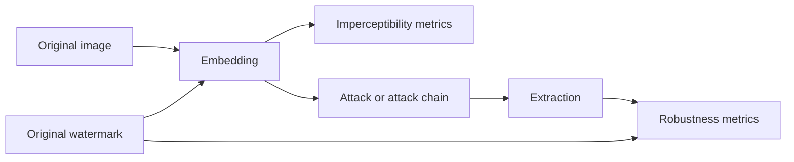

# DWARF — Digital Watermarking Robustness Framework

[](https://github.com/KKZbinyakov/digital-watermarking-robustness-framework/actions/workflows/generate-architecture.yml)
[](pyproject.toml)
[](LICENSE)

DWARF is a Python framework for composing and evaluating digital image watermarking methods under reproducible image distortions. It provides registries for embedding and extraction algorithms, image attacks, and quality or robustness metrics, together with a strict versioned format for experiment configuration.

The framework operates on NumPy arrays, includes optimized Cython implementations of transform-domain watermarking methods, and can be extended by importing user-defined solution classes.

## Contents

- [Capabilities](#capabilities)
- [Installation](#installation)
- [Quick start](#quick-start)
- [Solution registries](#solution-registries)
- [Experiment configuration](#experiment-configuration)
- [Component interface](#component-interface)
- [Included solution families](#included-solution-families)
- [Optional dependencies](#optional-dependencies)
- [Extending DWARF](#extending-dwarf)
- [Development and testing](#development-and-testing)
- [Project structure](#project-structure)
- [License](#license)

## Capabilities

- **Embedding and extraction registries.** Watermarking methods are available through a common registry and expose explicit `embedding()` and `extraction()` entry points.
- **Reproducible image attacks.** Compression, noise, filtering, color, brightness, and geometric transformations can be applied independently or chained in Python.
- **Imperceptibility and robustness metrics.** The built-in metric registry includes full-reference image metrics, no-reference metrics, bit recovery metrics, and binary detector metrics.
- **Strict experiment definitions.** Experiments can be described with immutable Pydantic models or safely loaded from versioned YAML files.
- **Explicit parameter spaces.** Configuration supports fixed parameters, Cartesian grids, and linked parameter variants without interpreting ordinary lists as sweeps.
- **Cython-accelerated methods.** Transform-domain algorithms and selected image operations are compiled as native extensions.
- **Extensible architecture.** Importing a subclass of a DWARF solution category automatically registers it under its class name.

A typical evaluation flow is:



## Installation

### Requirements

- Python 3.9 or newer;
- a C/C++ build toolchain for compiling Cython extensions;
- Git for cloning the repository.

Common compiler packages:

- **Windows:** Build Tools for Visual Studio with the C++ build tools component;
- **Debian/Ubuntu:** `build-essential` and `python3-dev`;
- **macOS:** Xcode Command Line Tools.

### Install from source

```bash
git clone https://github.com/KKZbinyakov/digital-watermarking-robustness-framework.git
cd digital-watermarking-robustness-framework

python -m venv .venv
```

Activate the environment:

```powershell
# Windows PowerShell
.\.venv\Scripts\Activate.ps1
```

```bash
# Linux or macOS
source .venv/bin/activate
```

Install DWARF together with the dependencies used by the bundled ready solutions:

```bash
python -m pip install --upgrade pip
python -m pip install -e ".[ready_solutions]"
```

For the core registries and strict configuration models without the optional SciPy and PyTorch dependency set, install the base package instead:

```bash
python -m pip install -e .
```

The package build compiles every `.pyx` module found under `dwarf/`. After changing Cython source files, rebuild the extensions in place:

```bash
python setup.py build_ext --inplace
```

## Quick start

Ready-made solutions register themselves when `dwarf.ready_solutions` is imported. The following example embeds a short watermark into the luminance channel with DCT, applies JPEG compression, extracts the watermark, and calculates PSNR and BER.

```python
import numpy as np
from PIL import Image

import dwarf.ready_solutions  # Populates all ready-solution registries.
from dwarf import Attack_Core, Embedding_Core, Expertise_Core

watermark_text = "1011001110001111"
watermark_bits = np.fromiter(
    (int(bit) for bit in watermark_text),
    dtype=np.int32,
)

rgb = np.asarray(Image.open("input.jpg").convert("RGB"), dtype=np.uint8)
ycbcr = np.asarray(Image.fromarray(rgb).convert("YCbCr"), dtype=np.uint8).copy()
luma = ycbcr[..., 0]

capacity = (luma.shape[0] // 8) * (luma.shape[1] // 8)
if watermark_bits.size > capacity:
    raise ValueError(
        f"The watermark contains {watermark_bits.size} bits, "
        f"but this image can store only {capacity}."
    )

# The current DCT implementation operates on a two-dimensional image matrix.
# A zero extraction threshold produces binary decisions only. With a positive
# threshold, extraction may return -1 for an uncertain bit.
embedded_luma = Embedding_Core.DCT.embedding(
    input_image=luma,
    watermark_bits=watermark_bits,
    margin=150.0,
    threshold=0.0,
)

ycbcr[..., 0] = np.clip(np.rint(embedded_luma), 0, 255).astype(np.uint8)
embedded_rgb = np.asarray(
    Image.fromarray(ycbcr, "YCbCr").convert("RGB"),
    dtype=np.uint8,
)

attacked_rgb = Attack_Core.Jpeg.attack(
    input_image=embedded_rgb,
    quality=75,
)
attacked_luma = np.asarray(
    Image.fromarray(attacked_rgb).convert("YCbCr"),
    dtype=np.uint8,
)[..., 0]

extracted_bits = Embedding_Core.DCT.extraction(
    input_image=attacked_luma,
    num_bits=watermark_bits.size,
    threshold=0.0,
)
extracted_text = "".join(str(int(bit)) for bit in extracted_bits)

psnr = Expertise_Core.PSNR.expertise(
    original_image=rgb,
    distorted_image=embedded_rgb,
)
ber = Expertise_Core.BER.expertise(
    original_bits=watermark_text,
    extracted_bits=extracted_text,
)

Image.fromarray(embedded_rgb).save("watermarked.png")
Image.fromarray(attacked_rgb).save("attacked.png")

print(f"Extracted watermark: {extracted_text}")
print(f"PSNR after embedding: {psnr:.3f} dB")
print(f"BER after JPEG:       {ber:.6f}")
```

Important interface details:

- ready-made attacks accept an image through `input_image` and return a writable RGB `numpy.ndarray` with `dtype=uint8`;
- transform-domain embedding methods can have method-specific input requirements, such as a two-dimensional luminance matrix;
- DCT extraction can return `-1` for an uncertain bit when a positive threshold is used;
- binary metrics such as BER accept strings containing only `0` and `1`;
- stochastic attacks expose a `seed` parameter where applicable.

## Solution registries

DWARF keeps separate registries for attacks, embedding methods, and metrics. Import ready solutions before querying them:

```python
import dwarf.ready_solutions
from dwarf import Attack_Core, Embedding_Core, Expertise_Core


def concrete_names(registry: dict[str, type]) -> list[str]:
    return sorted(
        name
        for name in registry
        if not name.startswith("Ready_")
    )

print("Attacks:")
print(concrete_names(Attack_Core.get_registered_attacks()))

print("Embedding methods:")
print(concrete_names(Embedding_Core.get_registered_embeddings()))

print("Metrics:")
print(concrete_names(Expertise_Core.get_registered_expertises()))
```

A registered solution can be resolved either as an attribute or by name:

```python
jpeg_class = Attack_Core.Jpeg
same_class = Attack_Core.get_attack_class_by_name("Jpeg")
assert jpeg_class is same_class
```

This makes it possible to select components dynamically from validated configuration data without hard-coding imports for every implementation.

## Experiment configuration

The `dwarf.pipeline` package provides a strict, immutable configuration model. A configuration can be created in Python or loaded from YAML; both forms produce the same `ExperimentConfig` object.

### YAML configuration

A complete example is available at [`examples/pipeline/dct_jpeg.yaml`](examples/pipeline/dct_jpeg.yaml). A compact configuration looks like this:

```yaml
schema_version: 1

experiment:
  name: dct-jpeg-example
  seed: 42
  repeats: 1

dataset:
  type: directory
  path: ./data/images
  recursive: true
  extensions: [.png, .jpg, .jpeg]
  preprocessing:
    color_mode: RGB
    resize: [512, 512]
    resample: lanczos
    exif_transpose: true

watermark:
  type: random_bits
  length: 64
  scope: fixed_for_run

embeddings:
  - id: dct
    name: DCT
    embedding:
      params:
        fixed:
          threshold: 25.0
        grid:
          margin: [100.0, 150.0, 200.0]
    extraction:
      params:
        fixed:
          threshold: 25.0

attack_scenarios:
  - id: clean
    steps: []

  - id: jpeg
    steps:
      - name: Jpeg
        params:
          grid:
            quality: [30, 50, 75, 90]

metrics:
  - id: embedding-psnr
    name: PSNR
    checkpoint: after_embedding
    inputs:
      original_image: original_image
      distorted_image: embedded_image

  - id: watermark-ber
    name: BER
    checkpoint: after_extraction
    inputs:
      original_bits: original_watermark
      extracted_bits: extracted_watermark
```

Load and validate the file:

```python
from dwarf.pipeline import load_experiment_config

config = load_experiment_config("experiment.yaml")

print(config.experiment.name)
print(config.dataset.path)
print(config.embeddings[0].name)
print(config.embeddings[0].embedding.params.declared_variant_count)
```

Relative dataset and output paths are resolved against the directory containing the YAML file. Pass `resolve_paths=False` to keep relative paths unchanged:

```python
config = load_experiment_config(
    "experiment.yaml",
    resolve_paths=False,
)
```

### Python configuration

The same schema can be constructed directly from Python data:

```python
from dwarf.pipeline import ExperimentConfig

config = ExperimentConfig.model_validate(
    {
        "schema_version": 1,
        "experiment": {
            "name": "dct-jpeg-example",
            "seed": 42,
        },
        "dataset": {
            "type": "directory",
            "path": "./data/images",
        },
        "watermark": {
            "type": "fixed_bits",
            "bits": "1011001110001111",
        },
        "embeddings": [
            {
                "id": "dct",
                "name": "DCT",
            }
        ],
    }
)
```

### Parameter declarations

Each operation supports three explicit parameter sections:

```yaml
params:
  fixed:
    threshold: 25.0

  grid:
    margin: [100.0, 150.0, 200.0]
```

- `fixed` contains values applied to every declared variant;
- `grid` contains independent candidate axes and represents their Cartesian product;
- `variants` contains explicitly linked parameter combinations and cannot be used together with `grid`.

Example with linked variants:

```yaml
params:
  variants:
    - margin: 100.0
      threshold: 20.0
    - margin: 150.0
      threshold: 25.0
    - margin: 200.0
      threshold: 35.0
```

### Validation guarantees

The configuration layer:

- rejects unknown fields instead of silently ignoring them;
- uses strict scalar types for seeds, limits, counters, and Boolean options;
- rejects duplicate YAML keys;
- accepts only unambiguous `true` and `false` Boolean literals;
- rejects unsafe Python-specific YAML tags;
- validates unique IDs for embeddings, attack scenarios, and metrics;
- prevents runtime-managed values such as `input_image` and `watermark_bits` from being placed in parameter sections;
- validates which artifacts are available at each metric checkpoint;
- deeply freezes nested configuration values after validation;
- preserves structured Pydantic validation errors with precise field locations.

Configuration loading and algorithm execution are separate operations: `load_experiment_config()` validates and normalizes an experiment definition, while ready solutions are invoked explicitly through the registries described above.

## Component interface

| Component | Registry | Entry point | Typical result |
|---|---|---|---|
| Attack | `Attack_Core` | `attack(**kwargs)` | RGB image matrix |
| Embedding method | `Embedding_Core` | `embedding(**kwargs)` | image containing a watermark |
| Extraction method | `Embedding_Core` | `extraction(**kwargs)` | recovered watermark data |
| Metric | `Expertise_Core` | `expertise(**kwargs)` | numeric score |

Arguments are method-specific and are passed by keyword. Inspect the implementation docstring for the accepted parameters and their defaults:

```python
help(Attack_Core.Crop.attack)
help(Embedding_Core.DCT.embedding)
help(Embedding_Core.DCT.extraction)
help(Expertise_Core.SSIM.expertise)
```

Ready-made attacks are designed to be composable:

```python
image_after_attacks = Attack_Core.Jpeg.attack(
    input_image=Attack_Core.Gaussian_Blur.attack(
        input_image=image,
        sigma=1.2,
    ),
    quality=60,
)
```

For stochastic operations, pass an explicit seed to obtain reproducible output:

```python
noisy = Attack_Core.AWGN.attack(
    input_image=image,
    sigma=0.05,
    seed=42,
)
```

## Included solution families

### Embedding and extraction

The ready-solution package contains transform-domain methods based on:

- DCT;
- DFT;
- DWT;
- Contourlet transforms;
- SVD;
- combined DCT, DWT, and SVD constructions.

Several frequency-domain implementations are written in Cython and are available only after native extensions have been built.

### Image attacks

Built-in attack families include:

- **compression:** JPEG, JPEG 2000, WebP, HEIC, AVIF, TIFF, BPG, and FLIF;
- **noise:** additive white Gaussian, impulse, periodic, Poisson, salt-and-pepper, and speckle noise;
- **filtering:** Gaussian, median, box, bilateral, Wiener, anisotropic diffusion, unsharp masking, and homomorphic filtering;
- **color and brightness:** brightness and contrast changes, gamma correction, grayscale conversion, color jitter, color-space noise, bit-depth reduction, quantization, dithering, and histogram equalization;
- **geometric:** configurable cropping with padding, resizing, or raw cropped output.

### Metrics

Imperceptibility and image-quality metrics include:

- MSE, PSNR, SSIM, and MS-SSIM;
- FSIM and FSIMc;
- VIF;
- LPIPS and DISTS;
- BRISQUE and NIQE.

Robustness and detector metrics include:

- BER and normalized correlation;
- watermark PSNR;
- accuracy, precision, recall, and F1;
- AUC and p-value.

Use the registry enumeration example rather than relying on a hard-coded list when selecting components programmatically.

## Optional dependencies

The core package keeps heavy codecs and neural quality metrics optional.

| Command | Enables |
|---|---|
| `python -m pip install -r requirements-codecs.txt` | HEIC and AVIF compression attacks |
| `python -m pip install -r requirements-metrics.txt` | LPIPS, DISTS, NIQE, and BRISQUE through `pyiqa` |

BPG and FLIF attacks require external command-line encoders and decoders available through `PATH`:

- BPG: `bpgenc` and `bpgdec` from `libbpg`;
- FLIF: the `flif` executable.

When an optional dependency required by a component is unavailable, that component raises a descriptive `RuntimeError` when invoked.

## Extending DWARF

A custom solution is registered when its class is imported. The registry key is the class name, so use a distinct descriptive name.

Example custom attack:

```python
import numpy as np

from dwarf.core.attack_orchestrator.attack_core import Ready_Geometric_Attacks


class Horizontal_Flip(Ready_Geometric_Attacks):
    """Return a horizontally mirrored RGB image."""

    @staticmethod
    def attack(**args):
        defaults = {"input_image": None}
        args = {**defaults, **args}

        image = np.asarray(args["input_image"])
        if image.ndim != 3 or image.shape[2] != 3:
            raise ValueError(
                f"expected an RGB image of shape (H, W, 3), got {image.shape}"
            )

        image = np.clip(image, 0, 255).round().astype(np.uint8)
        return np.ascontiguousarray(image[:, ::-1])
```

After importing the module containing this class:

```python
from dwarf import Attack_Core

mirrored = Attack_Core.Horizontal_Flip.attack(input_image=image)
```

Custom implementations should:

- expose the corresponding static entry point with `**args`;
- declare defaults for every accessed argument;
- validate invalid parameter values explicitly;
- avoid modifying input arrays in place;
- return data compatible with the next component in a chain;
- include tests covering defaults, edge cases, and invalid inputs.

## Development and testing

Install development dependencies:

```bash
python -m pip install -r requirements-dev.txt
```

Run the same checks used by CI:

```bash
python setup.py build_ext --inplace
ruff check .
ruff format --check .
pytest -q
```

Run only the strict configuration tests:

```bash
pytest -q tests/test_pipeline_config.py
```

Apply automatic formatting before committing:

```bash
ruff check --fix .
ruff format .
```

The GitHub Actions workflow builds the Cython extensions, runs linting and formatting checks, and executes the test suite on Python 3.10, 3.11, and 3.12.

## Project structure

```text
dwarf/
├── core/                       # Base classes, categories, and registries
├── pipeline/                   # Strict experiment configuration models and YAML loader
└── ready_solutions/
    ├── attack_solutions/       # Image attacks
    ├── embedding_solutions/    # Embedding and extraction methods
    ├── expertise_solutions/    # Quality and robustness metrics
    └── utils/                  # Shared numerical and image utilities

examples/
└── pipeline/                   # Versioned YAML experiment examples

tests/                          # Registry, contract, numerical, and configuration tests
setup.py                        # Recursive Cython extension build
pyproject.toml                  # Package metadata, dependencies, and tool configuration
```

## License

DWARF is distributed under the [MIT License](LICENSE).
