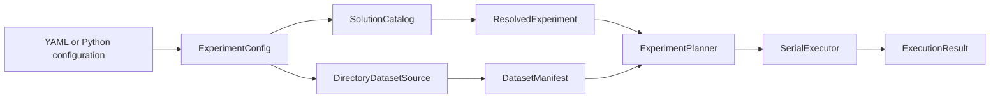
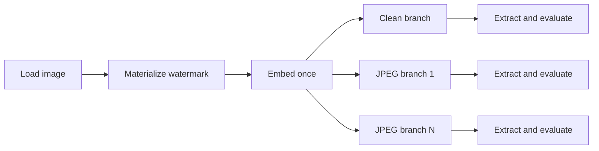

# DWARF — Digital Watermarking Robustness Framework

[](https://github.com/KKZbinyakov/digital-watermarking-robustness-framework/actions/workflows/generate-architecture.yml)
[](pyproject.toml)
[](LICENSE)

DWARF is a Python framework for reproducible evaluation of digital image
watermarking methods under configurable image distortions. It combines:

- registries for embedding, extraction, attack, and metric implementations;
- strict experiment configuration in Python or versioned YAML;
- semantic validation against the solutions available in the current environment;
- deterministic dataset manifests and experiment plans;
- serial end-to-end execution of embedding, attack, extraction, and metric stages;
- immutable, structured execution results;
- optimized Cython implementations of transform-domain watermarking methods.

The low-level registries expose all bundled ready solutions. The executable YAML
pipeline currently supports a smaller, explicitly described set of components so
that parameter validation, artifact contracts, and runtime conversion remain
predictable.

## Contents

- [Capabilities](#capabilities)
- [Installation](#installation)
- [Quick start](#quick-start)
- [Pipeline architecture](#pipeline-architecture)
- [Preparing a dataset](#preparing-a-dataset)
- [Running an experiment](#running-an-experiment)
- [Experiment configuration](#experiment-configuration)
- [Planning and execution model](#planning-and-execution-model)
- [Execution results](#execution-results)
- [Reproducibility and integrity](#reproducibility-and-integrity)
- [Pipeline-supported components](#pipeline-supported-components)
- [Low-level registries](#low-level-registries)
- [Bundled solution families](#bundled-solution-families)
- [Optional dependencies](#optional-dependencies)
- [Extending DWARF](#extending-dwarf)
- [Current execution scope](#current-execution-scope)
- [Development and testing](#development-and-testing)
- [Project structure](#project-structure)
- [License](#license)

## Capabilities

- **Strict experiment definitions.** Experiments can be constructed with
  immutable Pydantic models or loaded from safe, versioned YAML files.
- **Semantic solution validation.** Names such as `DCT`, `Jpeg`, `PSNR`, and
  `BER` are resolved to registered implementations before planning begins.
- **Explicit parameter spaces.** `fixed`, Cartesian `grid`, and linked
  `variants` are represented separately, so ordinary lists are never
  interpreted as parameter sweeps by accident.
- **Deterministic dataset manifests.** Selected files receive stable sample IDs,
  SHA-256 checksums, and an ordered manifest fingerprint.
- **Deterministic planning.** The planner creates stable embedding variants,
  attack variants, work units, case IDs, and operation seeds.
- **Reusable work units.** An image is loaded and watermarked once for a group of
  independent attack branches whenever the watermark scope allows reuse.
- **Ordered attack chains.** A scenario may contain zero, one, or several attack
  steps, each with its own parameter space.
- **Serial end-to-end execution.** The `Pipeline` facade executes embedding,
  attacks, extraction, and checkpoint-specific metrics in one process.
- **Canonical artifacts.** Images and watermarks are normalized through explicit
  `ImageArtifact`, `OriginalWatermark`, and `ExtractedWatermark` contracts.
- **Structured failures.** Work-unit, case, metric, timing, and error information
  is returned as immutable result records.
- **Extensible registries.** Importing a solution subclass registers it under its
  class name; pipeline-aware solutions additionally declare `SolutionSpec`
  metadata.

A complete experiment follows this logical path:



## Installation

### Requirements

- Python 3.9 or newer;
- a C/C++ build toolchain for compiling Cython extensions;
- Git for cloning the repository.

The GitHub Actions workflow currently exercises Python 3.10, 3.11, and 3.12.

Common compiler packages:

- **Windows:** Build Tools for Visual Studio with the C++ build tools component;
- **Debian/Ubuntu:** `build-essential` and `python3-dev`;
- **macOS:** Xcode Command Line Tools.

### Install from source

```bash
git clone https://github.com/KKZbinyakov/digital-watermarking-robustness-framework.git
cd digital-watermarking-robustness-framework

python -m venv .venv
```

Activate the environment:

```powershell
# Windows PowerShell
.\.venv\Scripts\Activate.ps1
```

```bash
# Linux or macOS
source .venv/bin/activate
```

Install DWARF together with the dependencies used by the bundled ready
solutions:

```bash
python -m pip install --upgrade pip
python -m pip install -e ".[ready_solutions]"
```

For the base package without the heavier optional ready-solution dependencies:

```bash
python -m pip install -e .
```

The package build discovers `.pyx` files recursively under `dwarf/`. Rebuild the
extensions after changing Cython sources:

```bash
python setup.py build_ext --inplace
```

Verify the public pipeline API:

```bash
python -c "from dwarf.pipeline import Pipeline; print('Pipeline import: OK')"
```

## Quick start

### 1. Add local images

Create this directory in the repository root:

```text
data/
└── coco/
    ├── image-01.jpg
    ├── image-02.png
    └── ...
```

The bundled serial examples accept `.png`, `.jpg`, and `.jpeg` files. Dataset
images are local inputs and are not distributed with the repository.

### 2. Inspect the plan

```python
from dwarf.pipeline import Pipeline

pipeline = Pipeline.from_yaml("examples/pipeline/dct_jpeg_serial.yaml")

pipeline.validate()
plan = pipeline.plan()
print(plan.summary())
```

This validates the YAML, resolves registered solutions, builds a dataset
manifest, expands parameter spaces, and reports the exact number of cases before
any watermarking operation is executed.

### 3. Run the experiment

From the repository root:

```bash
python -m examples.pipeline.run_serial \
    examples/pipeline/dct_jpeg_serial.yaml \
    --erasure-policy count_as_error
```

PowerShell accepts the same command on one line:

```powershell
python -m examples.pipeline.run_serial examples/pipeline/dct_jpeg_serial.yaml --erasure-policy count_as_error
```

The script prints the plan, elapsed time, work-unit and case counts, metric
counts, and failure statistics.

### 4. Run through the Python API

```python
from dwarf.pipeline import Pipeline

pipeline = Pipeline.from_yaml("examples/pipeline/dct_jpeg_serial.yaml")

plan = pipeline.plan()
print(plan.summary())

result = pipeline.run(
    erasure_policy="count_as_error",
)

print("Work units:", len(result.work_units))
print("Cases:", len(result.cases))
print("Metrics:", len(result.metrics))
print("Successful cases:", result.successful_case_count)
print("Partial cases:", result.partial_case_count)
print("Failed cases:", result.failed_case_count)
print("Skipped cases:", result.skipped_case_count)
print("Failed metrics:", result.failed_metric_count)
```

## Pipeline architecture

### Configuration and semantic resolution

`Pipeline.from_yaml()` first loads an `ExperimentConfig`. Structural validation
checks field names, strict scalar types, identifiers, parameter-space structure,
metric checkpoints, and artifact references.

`SolutionCatalog` then performs environment-dependent semantic validation:

- every configured solution must be registered in the correct category;
- the solution must provide pipeline metadata;
- required entry points must exist;
- configured parameters must be known and type-compatible;
- numeric parameters must satisfy declared ranges;
- linked embedding and extraction parameters must remain compatible;
- metric bindings must refer to artifacts available at their checkpoint.

The result is a `ResolvedExperiment` that binds configuration declarations to
actual implementation classes and `SolutionSpec` metadata.

### Dataset source and manifest

`DirectoryDatasetSource` scans a configured directory and applies:

- recursive or non-recursive discovery;
- extension filtering;
- include and exclude patterns;
- deterministic sorting or seeded shuffling;
- a sample limit;
- EXIF transpose, RGB conversion, and configured resizing during loading.

`DatasetManifest` stores small `SampleReference` records rather than decoded
images. Each record contains a stable sample ID, relative path, file metadata,
and SHA-256 checksum.

### Artifact contracts

The runtime uses these canonical objects:

```text
ImageArtifact
    ndarray shape: (height, width, 3)
    dtype: uint8
    color model: RGB
    C-contiguous and writable

OriginalWatermark
    ndarray shape: (length,)
    dtype: uint8
    allowed values: 0, 1

ExtractedWatermark
    ndarray shape: (length,)
    dtype: int8
    allowed values: -1, 0, 1
```

`-1` represents an uncertain extraction decision and is handled explicitly by
the selected erasure policy.

### Runtime adapters

Runtime adapters connect canonical pipeline artifacts to solution-specific
entry points. The default adapters:

- pass independent arrays to embedding, attack, extraction, and metric methods;
- normalize image results back to `ImageArtifact`;
- materialize fixed or seeded random watermarks;
- adapt legacy luminance-based embedding implementations when required;
- convert watermark artifacts into the representation expected by BER;
- inject deterministic seeds into solutions that declare a `seed` parameter.

Custom adapters can be registered per solution with `RuntimeAdapterRegistry`.

## Preparing a dataset

The example configurations reference this path relative to the YAML file:

```yaml
dataset:
  type: directory
  path: ../../data/coco
  recursive: true
  extensions: [.png, .jpg, .jpeg]
  limit: 100
  shuffle: false
  preprocessing:
    color_mode: RGB
    resize: [512, 512]
    resample: lanczos
    exif_transpose: true
```

Because relative paths are resolved against the directory containing the YAML,
`../../data/coco` under `examples/pipeline/` resolves to `data/coco` in the
repository root.

The directory must exist before calling `pipeline.plan()` or `pipeline.run()`.
A missing directory raises `DatasetDiscoveryError`.

To use another dataset, set an absolute path or another YAML-relative path:

```yaml
dataset:
  type: directory
  path: "C:/Users/user/Pictures/watermark-test"
```

Forward slashes are convenient in Windows YAML paths because they avoid escape
ambiguity.

By default, file integrity is checked again when each sample is loaded. The
example runner can disable this check explicitly:

```bash
python -m examples.pipeline.run_serial \
    examples/pipeline/dct_jpeg_serial.yaml \
    --skip-integrity-check
```

## Running an experiment

### Small serial smoke experiment

```bash
python -m examples.pipeline.run_serial \
    examples/pipeline/dct_jpeg_serial.yaml
```

`dct_jpeg_serial.yaml` is intended for a quick end-to-end check. It uses:

- one seeded random 64-bit watermark for the run;
- three DCT embedding margins;
- one clean branch;
- four JPEG quality variants;
- PSNR after embedding and attack;
- BER after extraction.

For `N` selected images, it creates:

```text
work units = N × 3
cases      = N × 3 × 5
metrics    = N × 3 + 2 × (N × 3 × 5)
```

### Representative parameter sweep

```bash
python -m examples.pipeline.run_serial \
    examples/pipeline/dct_jpeg_representative_serial.yaml \
    --erasure-policy count_as_error
```

`dct_jpeg_representative_serial.yaml` is a broader demonstration of the
imperceptibility/robustness trade-off. It uses:

- up to eight images resized to `512 × 512`;
- a reproducible 1024-bit watermark per image;
- six DCT margin values from weak to strong embedding;
- eight single-JPEG quality values;
- two ordered double-JPEG variants;
- embedding PSNR, attack-only PSNR, end-to-end PSNR, and BER.

For `N` selected images, it creates:

```text
embedding variants = 6
attack variants    = 1 clean + 8 single JPEG + 2 double JPEG = 11
work units         = N × 6
cases              = N × 6 × 11 = 66N
metric evaluations = N × 6 + 3 × 66N = 204N
```

The experiment is designed to expose a range from nearly random recovery under
weak embedding and severe compression to low BER under stronger embedding or
milder compression. Exact values depend on the input images.

### Planning without execution

```python
from dwarf.pipeline import Pipeline

pipeline = Pipeline.from_yaml("examples/pipeline/dct_jpeg_representative_serial.yaml")

resolved = pipeline.validate()
plan = pipeline.plan()

print("Catalog fingerprint:", resolved.catalog_fingerprint)
print(plan.summary())
```

Planning does not decode every image or run an algorithm. It builds the exact,
deterministic experiment structure and enforces `experiment.max_cases` before
computation starts.

## Experiment configuration

### YAML configuration

A compact executable configuration looks like this:

```yaml
schema_version: 1

experiment:
  name: dct-jpeg-example
  seed: 42
  repeats: 1
  max_cases: 10000
  allow_large_plan: false

plugins: []

dataset:
  type: directory
  path: ../../data/coco
  recursive: true
  extensions: [.png, .jpg, .jpeg]
  preprocessing:
    color_mode: RGB
    resize: [512, 512]
    resample: lanczos
    exif_transpose: true

watermark:
  type: random_bits
  length: 64
  scope: fixed_for_run

embeddings:
  - id: dct
    name: DCT
    embedding:
      params:
        fixed:
          threshold: 25.0
        grid:
          margin: [100.0, 150.0, 200.0]
    extraction:
      params:
        fixed:
          threshold: 25.0

attack_scenarios:
  - id: clean
    steps: []

  - id: jpeg
    steps:
      - name: Jpeg
        params:
          grid:
            quality: [30, 50, 75, 90]

metrics:
  - id: embedding-psnr
    name: PSNR
    checkpoint: after_embedding
    inputs:
      original_image: original_image
      distorted_image: embedded_image

  - id: attack-psnr
    name: PSNR
    checkpoint: after_attack
    inputs:
      original_image: embedded_image
      distorted_image: attacked_image

  - id: watermark-ber
    name: BER
    checkpoint: after_extraction
    inputs:
      original_bits: original_watermark
      extracted_bits: extracted_watermark
    params:
      fixed:
        allow_length_mismatch: false

execution:
  backend: serial
  workers: 1
  max_in_flight: 1
  start_method: auto
  fail_fast: false
  show_progress: true
```

Load without executing:

```python
from dwarf.pipeline import load_experiment_config

config = load_experiment_config("examples/pipeline/dct_jpeg_serial.yaml")

print(config.experiment.name)
print(config.dataset.path)
print(config.embeddings[0].name)
```

Pass `resolve_paths=False` to preserve relative paths:

```python
config = load_experiment_config(
    "examples/pipeline/dct_jpeg_serial.yaml",
    resolve_paths=False,
)
```

### Python configuration

The same schema can be constructed directly in Python and passed to `Pipeline`:

```python
from dwarf.pipeline import ExperimentConfig, Pipeline

config = ExperimentConfig.model_validate(
    {
        "schema_version": 1,
        "experiment": {
            "name": "python-defined-example",
            "seed": 42,
        },
        "dataset": {
            "type": "directory",
            "path": "data/coco",
        },
        "watermark": {
            "type": "fixed_bits",
            "bits": "1011001110001111",
        },
        "embeddings": [
            {
                "id": "dct",
                "name": "DCT",
            }
        ],
        "execution": {
            "backend": "serial",
        },
    }
)

result = Pipeline(config).run()
print(result.successful_case_count)
```

When constructing a configuration directly in Python, relative paths are
interpreted by `DirectoryDatasetSource` from the process working directory.

### Parameter declarations

Each operation supports three explicit parameter sections.

Fixed values are applied to every variant:

```yaml
params:
  fixed:
    threshold: 25.0
```

A grid forms the Cartesian product of independent axes:

```yaml
params:
  fixed:
    threshold: 25.0
  grid:
    margin: [50.0, 100.0, 150.0]
```

Explicit variants preserve linked combinations:

```yaml
params:
  variants:
    - margin: 50.0
      threshold: 10.0
    - margin: 100.0
      threshold: 20.0
    - margin: 150.0
      threshold: 30.0
```

`grid` and `variants` are mutually exclusive inside one parameter space.

### Watermark scopes

Random watermarks support three scopes:

- `fixed_for_run` — one watermark is shared by all samples and cases;
- `per_image` — each image receives one reproducible watermark shared by its
  variants;
- `per_case` — each case receives a separate watermark and cannot reuse an
  embedding result across attack branches.

Fixed bit strings use:

```yaml
watermark:
  type: fixed_bits
  bits: "1011001110001111"
```

### Validation guarantees

The configuration and catalog layers:

- reject unknown configuration fields;
- use strict scalar types for seeds, limits, counters, and Boolean options;
- reject duplicate YAML keys and unsafe Python-specific YAML tags;
- accept only unambiguous `true` and `false` Boolean literals;
- validate unique IDs for embeddings, attack scenarios, and metrics;
- prevent runtime-managed arguments from being declared as user parameters;
- reject unknown or unsupported solution names;
- validate solution categories, entry points, parameter types, and ranges;
- validate linked embedding/extraction parameters;
- validate metric checkpoints and artifact bindings;
- preserve structured error paths for invalid declarations.

`load_experiment_config()` performs structural validation and path
normalization without running an experiment. `Pipeline.validate()` adds solution
discovery and semantic validation. `Pipeline.plan()` creates the deterministic
plan, and `Pipeline.run()` executes it with the configured backend.

## Planning and execution model

### Experiment cases

One `ExperimentCase` represents:

```text
one sample
× one embedding variant
× one attack-scenario variant
× one repeat
× one watermark reference
```

It carries stable identifiers and operation seeds, including:

```text
case_id
work_unit_id
sample
embedding variant
attack variant
repeat index
embedding seed
case seed
watermark reference
```

### Work units

A `WorkUnit` groups cases that can reuse the same loaded image, watermark, and
embedding result.



For every independent attack case, the executor starts from a fresh copy of the
same embedded image. One branch therefore cannot mutate the input of another.
Within a multi-step scenario, attacks are applied in the configured order.

### Metric checkpoints

Metrics can run at these checkpoints:

```text
after_embedding
    original_image
    embedded_image
    original_watermark

after_attack
    original_image
    embedded_image
    attacked_image
    original_watermark

after_extraction
    original_image
    embedded_image
    attacked_image
    original_watermark
    extracted_watermark
```

`after_embedding` metrics are evaluated once per work unit. `after_attack` and
`after_extraction` metrics are evaluated once per case.

### Failure handling

With `fail_fast: false`:

- a load, watermark-materialization, or embedding failure marks the work unit as
  `failed` and its cases as `skipped`;
- an attack or extraction failure marks only the affected case as `failed`;
- a metric failure is recorded as a failed `MetricResult`, while the case is
  marked `partial`;
- unaffected work units and cases continue.

With `fail_fast: true`, the first operation error raises
`ExecutionAbortedError`.

## Execution results

`Pipeline.run()` returns an immutable in-memory `ExecutionResult`.

```python
result = pipeline.run()

print(result.plan_fingerprint)
print(result.catalog_fingerprint)
print(result.manifest_fingerprint)
print(result.duration_seconds)

print(result.successful_case_count)
print(result.partial_case_count)
print(result.failed_case_count)
print(result.skipped_case_count)
print(result.successful_metric_count)
print(result.failed_metric_count)
```

The result hierarchy is:

```text
ExecutionResult
└── WorkUnitResult
    ├── work-unit metrics
    └── CaseResult
        ├── case metrics
        ├── operation timings
        └── optional OperationError
```

Each metric record contains:

```text
metric_id
metric_variant_id
solution_name
checkpoint
work_unit_id
case_id
status
value
parameters
duration_seconds
optional error
```

Inspect metric values:

```python
for metric in result.metrics:
    print(
        metric.metric_id,
        metric.checkpoint,
        metric.case_id,
        metric.status.value,
        metric.value,
    )
```

Convert the complete result into plain Python containers:

```python
payload = result.to_dict()
```

Metric values may legitimately be infinite. For example, attack-only PSNR is
`inf` for a clean scenario because the embedded and attacked images are
identical.

### Result statuses

| Status | Meaning |
|---|---|
| `success` | The operation or case completed successfully. |
| `partial` | Core case operations completed, but at least one metric failed. |
| `failed` | The work unit or case could not complete its required operations. |
| `skipped` | The case was not attempted because a shared earlier stage failed. |

### Erasure handling

An extracted watermark may contain `-1` for an uncertain bit. BER supports three
explicit policies:

| Policy | Behavior |
|---|---|
| `count_as_error` | Every erasure is counted as an incorrect bit. This is the default. |
| `ignore` | Erased positions are removed from both bit strings before BER. |
| `fail` | A BER evaluation containing an erasure is marked as failed. |

Use a policy from Python:

```python
result = pipeline.run(
    erasure_policy="count_as_error",
)
```

Or from the example runner:

```bash
python -m examples.pipeline.run_serial \
    examples/pipeline/dct_jpeg_serial.yaml \
    --erasure-policy ignore
```

## Reproducibility and integrity

A plan is determined by:

- the validated experiment configuration;
- the resolved solution catalog;
- the ordered dataset manifest;
- the experiment seed.

Repeated serial runs over the same configuration and unchanged dataset produce
the same:

- catalog, manifest, and plan fingerprints;
- sample and variant identities;
- work-unit and case IDs;
- random watermark instances;
- embedding and case seeds;
- attack-step seeds derived by the runtime.

Dataset integrity is checked by default when a sample is loaded. If a file no
longer matches the manifest size or checksum, execution records a dataset
integrity failure instead of silently using changed input data.

Call `reset_runtime_state()` to discard a cached manifest and plan after changing
local dataset files:

```python
pipeline.reset_runtime_state()
plan = pipeline.plan()
```

## Pipeline-supported components

The executable pipeline currently has complete metadata and runtime support for:

| Category | Supported components |
|---|---|
| Dataset source | Local directory containing PNG or JPEG images |
| Embedding and extraction | `DCT` |
| Attack | `Jpeg`, including ordered chains of JPEG steps |
| Metrics | `PSNR`, `BER` |
| Execution backend | `serial` |
| Result representation | In-memory `ExecutionResult` |

A solution being present in a low-level registry does not automatically make it
valid in experiment YAML. It must also declare pipeline metadata and have a
compatible runtime contract or adapter.

## Low-level registries

DWARF keeps separate registries for attacks, embedding methods, and metrics.
Import ready solutions before querying them:

```python
import dwarf.ready_solutions
from dwarf import Attack_Core, Embedding_Core, Expertise_Core


def concrete_names(registry: dict[str, type]) -> list[str]:
    return sorted(name for name in registry if not name.startswith("Ready_"))


print("Attacks:")
print(concrete_names(Attack_Core.get_registered_attacks()))

print("Embedding methods:")
print(concrete_names(Embedding_Core.get_registered_embeddings()))

print("Metrics:")
print(concrete_names(Expertise_Core.get_registered_expertises()))
```

Resolve a class by name:

```python
jpeg_class = Attack_Core.Jpeg
same_class = Attack_Core.get_attack_class_by_name("Jpeg")
assert jpeg_class is same_class
```

Low-level entry points use keyword arguments:

| Component | Registry | Entry point | Typical result |
|---|---|---|---|
| Attack | `Attack_Core` | `attack(**kwargs)` | RGB image matrix |
| Embedding method | `Embedding_Core` | `embedding(**kwargs)` | image containing a watermark |
| Extraction method | `Embedding_Core` | `extraction(**kwargs)` | recovered watermark data |
| Metric | `Expertise_Core` | `expertise(**kwargs)` | numeric score |

Arguments remain implementation-specific. Inspect the implementation docstring:

```python
help(Attack_Core.Jpeg.attack)
help(Embedding_Core.DCT.embedding)
help(Embedding_Core.DCT.extraction)
help(Expertise_Core.PSNR.expertise)
```

The high-level pipeline is preferable when reproducible planning, artifact
conversion, attack isolation, metric checkpoints, and structured failures are
required.

## Bundled solution families

The following families are available through the low-level ready-solution
registries. Pipeline execution support is listed separately in
[Pipeline-supported components](#pipeline-supported-components).

### Embedding and extraction

The ready-solution package contains transform-domain methods based on:

- DCT;
- DFT;
- DWT;
- Contourlet transforms;
- SVD;
- combined DCT, DWT, and SVD constructions.

Several frequency-domain implementations are written in Cython and require the
native extensions to be built.

### Image attacks

Built-in attack families include:

- **compression:** JPEG, JPEG 2000, WebP, HEIC, AVIF, TIFF, BPG, and FLIF;
- **noise:** additive white Gaussian, impulse, periodic, Poisson,
  salt-and-pepper, and speckle noise;
- **filtering:** Gaussian, median, box, bilateral, Wiener, anisotropic
  diffusion, unsharp masking, and homomorphic filtering;
- **color and brightness:** brightness and contrast changes, gamma correction,
  grayscale conversion, color jitter, color-space noise, bit-depth reduction,
  quantization, dithering, and histogram equalization;
- **geometric:** configurable cropping with padding, resizing, or raw cropped
  output.

### Metrics

Imperceptibility and image-quality metrics include:

- MSE, PSNR, SSIM, and MS-SSIM;
- FSIM and FSIMc;
- VIF;
- LPIPS and DISTS;
- BRISQUE and NIQE.

Robustness and detector metrics include:

- BER and normalized correlation;
- watermark PSNR;
- accuracy, precision, recall, and F1;
- AUC and p-value.

Use registry enumeration rather than relying on these documentation lists when
selecting low-level components programmatically.

## Optional dependencies

The base package keeps heavy codecs and neural quality metrics optional.

| Command | Enables |
|---|---|
| `python -m pip install -r requirements-codecs.txt` | HEIC and AVIF compression attacks |
| `python -m pip install -r requirements-metrics.txt` | LPIPS, DISTS, NIQE, and BRISQUE through `pyiqa` |

BPG and FLIF attacks require external command-line encoders and decoders on
`PATH`:

- BPG: `bpgenc` and `bpgdec` from `libbpg`;
- FLIF: the `flif` executable.

A component raises a descriptive runtime error when an optional dependency it
requires is unavailable.

## Extending DWARF

### Low-level registry extension

A custom solution is registered when its class is imported. The registry key is
the class name, so use a distinct, descriptive name.

```python
import numpy as np

from dwarf.core.attack_orchestrator.attack_core import Ready_Geometric_Attacks


class Horizontal_Flip(Ready_Geometric_Attacks):
    """Return a horizontally mirrored RGB image."""

    @staticmethod
    def attack(**args):
        defaults = {"input_image": None}
        args = {**defaults, **args}

        image = np.asarray(args["input_image"])
        if image.ndim != 3 or image.shape[2] != 3:
            raise ValueError(f"expected an RGB image of shape (H, W, 3), got {image.shape}")

        image = np.clip(image, 0, 255).round().astype(np.uint8)
        return np.ascontiguousarray(image[:, ::-1])
```

After importing the module:

```python
from dwarf import Attack_Core

mirrored = Attack_Core.Horizontal_Flip.attack(
    input_image=image,
)
```

### Pipeline-aware extension

Registry membership alone is not sufficient for YAML execution. A pipeline-aware
solution also provides a `SolutionSpec`, either as `Class.PIPELINE_SPEC` or in
the plugin module's `DWARF_PIPELINE_SPECS` collection.

```python
import numpy as np

from dwarf.core.attack_orchestrator.attack_core import Ready_Geometric_Attacks
from dwarf.pipeline import (
    DataContract,
    SolutionKind,
    SolutionOperationSpec,
    SolutionSpec,
)


class Horizontal_Flip(Ready_Geometric_Attacks):
    PIPELINE_SPEC = SolutionSpec(
        name="Horizontal_Flip",
        kind=SolutionKind.ATTACK,
        operations={
            "attack": SolutionOperationSpec(
                entry_point="attack",
                parameters={},
                runtime_arguments=("input_image",),
            )
        },
        contracts={
            "input_image": DataContract.RGB_UINT8,
            "output_image": DataContract.RGB_UINT8,
        },
    )

    @staticmethod
    def attack(**args):
        image = np.asarray(args["input_image"])
        return np.ascontiguousarray(image[:, ::-1])
```

Reference the module from YAML:

```yaml
plugins:
  - my_project.custom_attacks
```

A custom solution whose runtime contract differs from the default canonical
contract can register a solution-specific `AttackRuntimeAdapter`,
`EmbeddingRuntimeAdapter`, or `MetricRuntimeAdapter` through
`RuntimeAdapterRegistry` before constructing `Pipeline`.

Custom implementations should:

- expose the corresponding static entry point with `**args`;
- declare defaults for every accessed argument;
- validate invalid parameters explicitly;
- avoid modifying caller-owned arrays in place;
- return data compatible with their declared contract;
- include tests for defaults, edge cases, and invalid inputs.

## Current execution scope

The current executable scope is intentionally explicit:

- `serial` is the implemented execution backend;
- selecting another backend raises `UnsupportedExecutionBackendError` rather
  than silently falling back to serial execution;
- results are returned in memory as `ExecutionResult`;
- automatic SQLite persistence, resume, CSV export, and HTML rendering are not
  performed by the serial executor;
- executable YAML support is limited to the components listed in
  [Pipeline-supported components](#pipeline-supported-components);
- the broader ready-solution set remains available through the low-level
  registries.

Configuration models may contain output and report declarations, but these
declarations are not result sinks for the current serial executor.

## Development and testing

Install development dependencies:

```bash
python -m pip install -r requirements-dev.txt
```

Build the Cython extensions and run the same core checks used by CI:

```bash
python setup.py build_ext --inplace
ruff check .
ruff format --check .
python -m pytest -q
```

Run the complete pipeline test group:

```bash
python -m pytest -q \
    tests/test_pipeline_config.py \
    tests/test_pipeline_catalog.py \
    tests/test_pipeline_artifacts.py \
    tests/test_pipeline_dataset.py \
    tests/test_pipeline_plan.py \
    tests/test_pipeline_planner.py \
    tests/test_pipeline_results.py \
    tests/test_pipeline_runtime.py \
    tests/test_pipeline_executor.py \
    tests/test_pipeline_executor_resolution.py \
    tests/test_pipeline_public_api.py
```

PowerShell equivalent:

```powershell
python -m pytest -q `
    tests/test_pipeline_config.py `
    tests/test_pipeline_catalog.py `
    tests/test_pipeline_artifacts.py `
    tests/test_pipeline_dataset.py `
    tests/test_pipeline_plan.py `
    tests/test_pipeline_planner.py `
    tests/test_pipeline_results.py `
    tests/test_pipeline_runtime.py `
    tests/test_pipeline_executor.py `
    tests/test_pipeline_executor_resolution.py `
    tests/test_pipeline_public_api.py
```

Apply automatic formatting before committing:

```bash
ruff check --fix .
ruff format .
```

Ruff also checks and formats supported fenced code blocks in Markdown, so run the
format check after changing this README.

## Project structure

```text
dwarf/
├── core/                       # Base categories, registries, and orchestrators
├── pipeline/
│   ├── __init__.py             # Public pipeline API
│   ├── artifacts.py            # Canonical image and watermark contracts
│   ├── catalog.py              # Solution discovery and semantic validation
│   ├── config.py               # Strict experiment configuration models
│   ├── config_loader.py        # Safe YAML loading and path resolution
│   ├── datasets.py             # Directory-backed dataset source
│   ├── exceptions.py           # Configuration, dataset, and planning errors
│   ├── executors.py            # Serial experiment executor
│   ├── manifest.py             # Immutable dataset manifests and sample IDs
│   ├── pipeline.py             # High-level Pipeline facade
│   ├── plan.py                 # Variants, work units, cases, and counts
│   ├── planner.py              # Deterministic experiment-plan construction
│   ├── resolved.py             # Semantically resolved experiment objects
│   ├── results.py              # Immutable execution result records
│   ├── runtime.py              # Runtime adapters and watermark materialization
│   └── solution_spec.py        # Pipeline metadata for registered solutions
└── ready_solutions/
    ├── attack_solutions/       # Bundled image attacks
    ├── embedding_solutions/    # Bundled embedding and extraction methods
    ├── expertise_solutions/    # Quality and robustness metrics
    └── utils/                  # Shared numerical and image utilities

examples/
└── pipeline/
    ├── dct_jpeg_serial.yaml
    ├── dct_jpeg_representative_serial.yaml
    └── run_serial.py

tests/                          # Unit, contract, integration, and pipeline tests
setup.py                        # Recursive Cython extension build
pyproject.toml                  # Package metadata, dependencies, and tool settings
```

## License

DWARF is distributed under the [MIT License](LICENSE).
